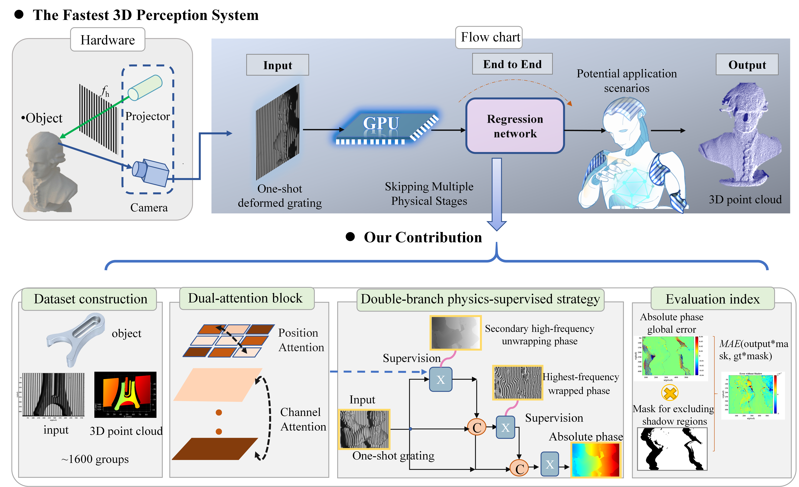
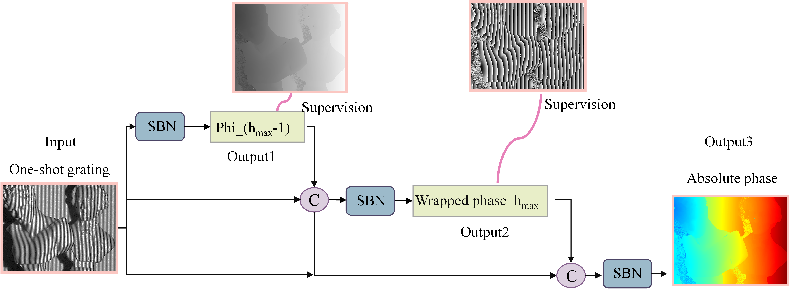
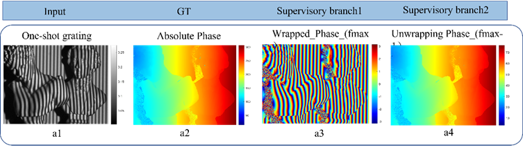
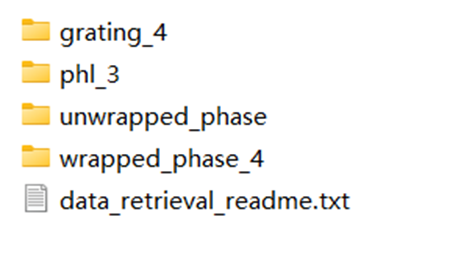

# Reliable One-shot 3D Reconstruction via Deep Learning: A Dual Attention and Dual-Branch Physically Supervised Model for Structured Light Perception



## Introduction

Single-frame end-to-end three-dimensional reconstruction based on deep learning adopting structured light has garnered widespread attention as a fast and accurate 3D perception solution. However, challenges remain due to the insufficient input information in a single grating and the difficulty of long-range semantic predictions across multiple nonlinear physical processes. Existing computer vision regression networks struggle to achieve high-precision per-pixel predictions of absolute phase maps. To address these challenges, we proposed a dual attention block (Da block) that adaptively integrates and optimizes spatial and channel-wise local features with their global dependencies. Furthermore, we designed a dual-branch physics-supervised strategy for end-to-end absolute phase prediction, utilizing the second-highest frequency unwrapped phase and the highest-frequency wrapped phase as auxiliary supervision, as these are most directly related to accurate absolute phase recovery. Besides, we introduced a novel evaluation metric that excludes shadow regions, focusing only on the valid object surfaces. This metric provides a more intuitive assessment of network performance. Specifically, we achieved state-of-the-art results in absolute phase prediction and 3D reconstruction on public and self-built datasets. Compared to ResNet34, the radius error of the standard sphere was reduced from 3.120 mm to 0.120 mm, and the RMSE was lowered from 3.941 mm to 0.122 mm. For the first time, single-frame 3D perception has been realized with fast, stable, and accurate performance, demonstrating the broad application potential of deep learning networks under physics-based supervision.



second-highest frequency unwrapped phase and the highest-frequency wrapped phase as auxiliary supervision

## Code

### 1. image-absolute phase

- Run Train

  ```bash
  python run.py #traing code
  ```

- Run Test

  ```bash
  python main_test #test code
  ```

### 2. absolute phase-3D point cloud

- Please run the `dl_output_3Drecon.m`

## Data

> [!NOTE]
>
> you can get data in [Microsoft OneDrive](https://1drv.ms/f/c/71786351de1712ac/EryoGD5KLkpMqcpgSSR9kIMBuHw7ZfcHnETgVZSYHTIDug?e=4XzCkJ)

### 1. grating-absolute phase





### 2. Evaluation Metric


## Updates

- [10/2024] We will continue to update the related research. Stay tuned!

## Agreement

- Authors reserves the right to terminate your access to the Dataset at any time.